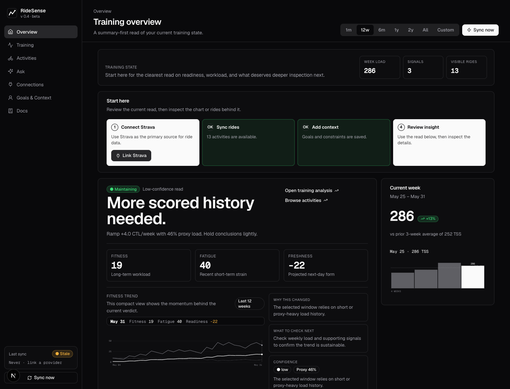
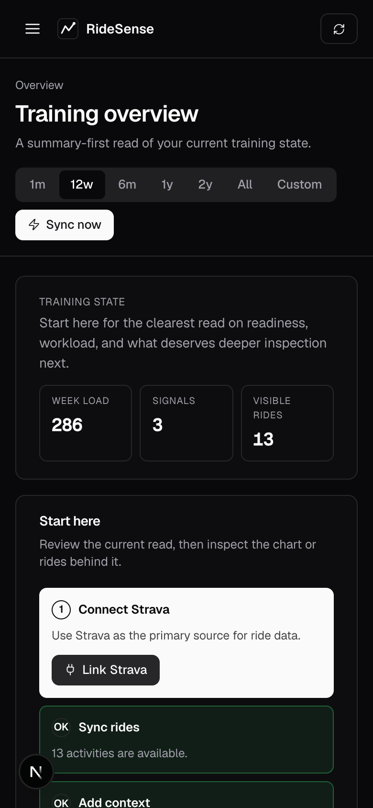

# RideSense

A hosted-training-insights MVP for cyclists. Users link TrainerRoad and Strava, sync workouts into one canonical timeline, and get trend/regression insights plus grounded Q&A over their own training data.

## What this project is

RideSense pulls a rider's workouts from both TrainerRoad and Strava, deduplicates the overlap into a single canonical activity timeline, and runs a deterministic analytics pipeline over it (weekly load, zone distribution, trends, regressions). A thin AI layer answers natural-language questions on top of those facts — it cites the metrics it used and stays out of medical or coaching prescriptions. The dashboard surfaces it as one unified view: activities, plan, comparison blocks, and an Ask interface.

The repository is organized as a working monorepo:

- `frontend/` — Next.js (App Router) dashboard with a shadcn/Tailwind UI.
- `backend/` — FastAPI service: REST API, provider sync workers, normalization + merge, analytics, AI answer adapter.
- `supabase/` — production Postgres schema with row-level security.
- `scripts/`, `docs/` — utilities and design notes.

The local backend uses SQLite for fast iteration. Production targets Supabase Postgres with the included schema and RLS.

## App Screenshots

Desktop overview:



Mobile overview:



## Local Setup

One-time:

```bash
# from the repo root — this .env is read by the backend (python-dotenv
# walks up from the backend cwd) and is the single source of truth for
# all server-side variables (DATABASE_URL, STRAVA_*, OPENAI_*, etc.)
cp .env.example .env
```

```bash
cd backend
python3 -m venv .venv
source .venv/bin/activate          # macOS / Linux
# Windows PowerShell:  .venv\Scripts\Activate.ps1
# Windows cmd.exe:     .venv\Scripts\activate.bat
pip install -r requirements.txt
```

```bash
cd frontend
pnpm install
```

Next.js does **not** read the repo-root `.env` — it only loads env files from
`frontend/`. Local dev uses a same-origin `/api/*` proxy from the Next server
to the backend. Defaults vary by variable:

- `API_PROXY_TARGET` is a **server-side** frontend env var used by
  `frontend/next.config.ts`. It defaults to `http://127.0.0.1:8000`, so local
  dev works without a frontend env file as long as the backend listens there.
- `NEXT_PUBLIC_SUPABASE_URL` and `NEXT_PUBLIC_SUPABASE_ANON_KEY` have **no
  defaults**. When either is missing, `frontend/lib/supabase.ts` exports
  `supabase = null` and the app runs unauthenticated against the dev backend.

If you need to override the backend target or wire Supabase, create
`frontend/.env.local` with `API_PROXY_TARGET` and any relevant
`NEXT_PUBLIC_*` values from `.env.example`.

Run (two terminals):

```bash
# terminal 1 — backend
cd backend
source .venv/bin/activate          # macOS / Linux
# Windows PowerShell:  .venv\Scripts\Activate.ps1
# Windows cmd.exe:     .venv\Scripts\activate.bat
uvicorn app.main:app --reload
```

```bash
# terminal 2 — frontend
cd frontend
pnpm dev
```

Open http://localhost:3000. With `DEV_AUTH_ENABLED=true` (the default), both servers resolve to a stable `demo-user`. If `backend/data/app.db` has been seeded (see `backend/scripts_seed_demo.py`), the dashboard will populate with demo activities, weekly load, and zone breakdown.

To enable real auth locally, create a Supabase project and set the following:

- `NEXT_PUBLIC_SUPABASE_URL` and `NEXT_PUBLIC_SUPABASE_ANON_KEY` in
  `frontend/.env.local` (these are read by the Next.js client).
- `SUPABASE_URL` (same value as `NEXT_PUBLIC_SUPABASE_URL`) and
  `SUPABASE_JWT_SECRET` in the repo-root `.env` — `backend/app/config.py`
  reads `SUPABASE_URL`, not the `NEXT_PUBLIC_*` variant, so it must be
  present for the backend to verify Supabase JWTs.
- `DEV_AUTH_ENABLED=false` in the same root `.env`.

## Connecting Strava

To pull real activities from Strava in local dev:

1. Sign in to https://www.strava.com/settings/api and click **Create &
   Manage Your App**. Strava only allows one app per account, so reuse
   any existing one if you have it.
2. Fill in the form:
   - **Application Name** — anything (e.g. "RideSense local").
   - **Category** — Training.
   - **Website** — `http://localhost:3000`.
   - **Authorization Callback Domain** — `localhost`. Strava asks for a
     domain, not a URL; the app sets the full path
     (`/strava/oauth/callback`) in code.
3. After creating the app, copy **Client ID** and **Client Secret** into
   the repo-root `.env`:

   ```bash
   STRAVA_CLIENT_ID=...
   STRAVA_CLIENT_SECRET=...
   STRAVA_REDIRECT_URI=http://localhost:8000/strava/oauth/callback
   ```

4. Restart the backend so the new env is loaded, then click **Link
   Strava** on the Connections page. You'll be redirected to Strava,
   approve the `read,activity:read_all` scopes, and bounce back to the
   dashboard. Click **Sync now** to pull your activity history.

The OAuth state token is content-encrypted (Fernet) and carries a
5-minute TTL, so a stolen redirect can't be replayed later. If Strava
later revokes the refresh token, the connection is automatically marked
`status="error"` on the next sync attempt and the UI will prompt you to
relink.

## Provider Strategy

- **Strava** uses official OAuth (authorize → code exchange → refresh).
  Access and refresh tokens are encrypted by `backend/app/security.seal_json`
  using Fernet (AES-128-CBC + HMAC-SHA256), with the key derived from
  `APP_SECRET_KEY`. In production, `APP_SECRET_KEY` should come from a managed
  secret store (KMS, Supabase Vault, etc.) rather than `.env`.
- **TrainerRoad** integration is currently **scaffolded only**.
  `backend/app/providers/trainerroad.py` exposes the API surface but
  `link_session_placeholder` returns `not_configured` and
  `sync_trainerroad_activities` returns an empty list. The intended
  production approach is browser session-link via Playwright that captures
  and stores cookies — never the TrainerRoad password.
- **File upload** (`POST /uploads/activity`) accepts GPX, TCX, and FIT
  exports up to 10 MB. The parser dispatches by extension, derives a
  content-hashed `provider_activity_id` so re-uploads are idempotent, and
  feeds the result through the same dedup/merge pipeline as provider sync.
  This is the recommended path for real data while the TrainerRoad
  scraper remains scaffolded.
- **Deduplication** is implemented in `backend/app/services/merge.py`:
  candidates from each provider are scored by start-time delta, duration
  delta, and name similarity, and merged into one canonical activity at a
  confidence threshold of 0.72 so training load is not double-counted.
  Source priority on conflict is TrainerRoad > Strava > upload.

## AI Boundary

The AI layer is decision support. It answers from facts produced by the
deterministic analytics pipeline (the model itself is non-deterministic but
its inputs are not), cites those facts via an `evidence` array of metric
IDs, and the prompt explicitly forbids inventing workouts, diagnoses, FTP
changes, or medical advice. When `OPENAI_API_KEY` is unset, a deterministic
fallback answer is returned with the same citation/caveat shape.
